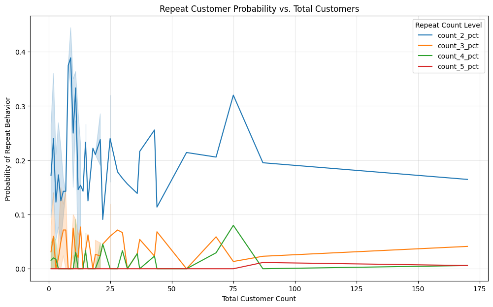

## 'FoodHub' Courier Service Delivery and Sales Optimization Strategy
Exploratory data analysis of order behavior and demand dynamics within a simulated New York food delivery platform.

## Project Overview
Analysis of ~1,900 food delivery orders to identify patterns across:

- Preparation and delivery time
- Order cost
- Customer ratings
- Cuisine distribution
- Order frequency

The objective is to surface operational and behavioral insights that inform delivery efficiency and customer retention.

## Methods
- SQL-based aggregation and querying
- Data manipulation with NumPy and Pandas
- Visualization using Matplotlib and Seaborn

## Repeat Behavior vs. Order Volume

This chart evaluates how the probability of repeat ordering changes as total customer count increases, segmented by repeat frequency thresholds (2–5 orders).

Key Takeaways
Repeat probability declines as volume increases, indicating diminishing marginal retention among broader customer cohorts
Higher repeat thresholds (4–5 orders) remain rare and unstable, suggesting a small core of highly loyal users
Early customer cohorts show higher variance, implying sensitivity to small sample sizes and localized behavior

